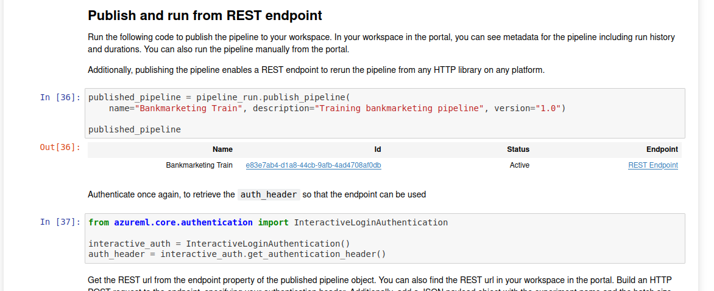

# Project: Operationalizing Machine Learning

In this project, I continued to work with the Bank Marketing dataset. 
I used Azure to configure a cloud-based machine learning production model, deployed it, and consumed it. 
I also created, publish, and consumed a pipeline. 

## Architectural Diagram
### Architectual diagram of the project and an introduction of each step.

## Key Steps
### Upload data
The first step is the import of the dataset (bankmarketing_train.csv) into Azure Machine 
Learning, so that it can be used when training a model. Datasets can be explored, 
use with a schema and versioned.

### Compute-cluster
To run a AutoML or a Hyperdrive experiment, you need to create a compute-cluster.
This is where the model training is performed, it may vary in count and size of nodes.

### The experiment is completed
In the experiment tab in the UI you can get an overview about the current running experiments 
and the ready ones. In the details of an AutoML experiment you can quickly see information about it and
a summary about the best performed model.

### Details for best model and metrics of best model
After an AutoML run is completed, a lot of metrics in the details page of each model are accessible.
This gives a deep insight to the training progress as well as the characteristics of the different
models AutoML tried to find the best solution.

### Explanation of best model
The model explanation provides a lot of charts and metrics to show why and how
a model does what it does.

### Model Endpoint 
After the training of a model is done, Azure ML can very quickly deploy it
so it can be tested via a REST API. This is a very useful way of providing
access to a trained model to other people. It's literally a one-click deployment
and powered by AKS or ACI. The endpoint also provisioned a swagger (openapi) documentation,
logging via Application Insights and security with API keys.

### Enabled logging
It's possible to enabled logging with Application Insights in the UI or with a python script.
Output of the logs.py script showing the enabled logging:

### Swagger (OpenAPI) 
The endpoint also provisions a swagger (openapi) documentation. A frontend running in 
docker can load this swagger.json and provide a straightforward solution to interact
with the trained model.

### API call with json 
This shows a successfully HTTP call to the deployed API
with a json payload in endpoint.py scropt.

### Benchmark
To test the REST API performance tools like Apache bench can be used.
This shows the output of a benchmark script with calling the API multiple times.

### The  of the created pipeline
Another way to start a AutoML experiment run in Azure is the usage of a pipeline.
The pipeline can be designed in the UI per drag and drop or by a python script. 
The benefit of a pipeline is to automate multiple runs if e.g. a dataset gets updated.

### Dataset
Pipeline also use dataset as input.

### RunDetails
The RunDetails output can be handy if the pipeline is creates with a jupyter notebook.
It shows the progress of the pipeline.

### Notebook deployed endpoint
In the notebook an output confirms the deployment of an endpoint

### The pipeline run
The UI also provides an overview of the pipeline run.

### Pipeline endpoint
The final step of a pipeline can be a deployed endpoint

## Potential improvements
Some ideas to improve the model performance, which are not done by AutoML:

### Using more training data
Using more data is a simple and good way to prevent over-fitting, 
and can increase accuracy.
If we can use more data, it becomes more difficult for the model to memorize exact patterns, 
and it's likely finds solutions that are more flexible.

### Statistical bias
It's important to check for statistical bias, to ensure the training 
data doesn't include isolated patterns that won't exist in live-prediction data. 

### Target leakage
A similar issue, where there is no over-fitting, but rather at prediction-time. 
Target leakage can occur when data is in the training set which is not normally 
present at prediction-time. This can be an easily happen, and can be the case for models
with very high accuracy.

### Using fewer features
This can help when over-fitting occurs by preventing having too many fields
what can lead to memorize specific patterns in the model. 
If it's possible to remove features and get the same accuracy, the resulting model 
is more flexible, and it lowers the risk of over-fitting.

## Screen Recording

